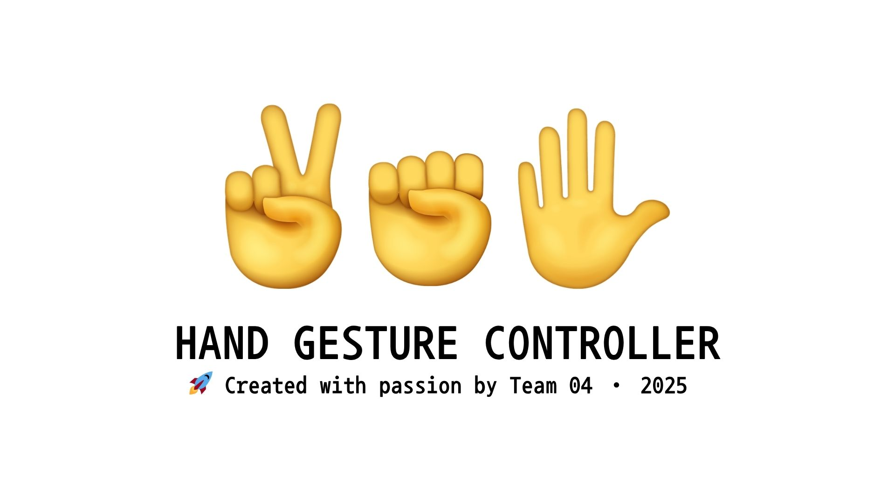

# Open Source Contribution Project - Team 4

### Hand Gesture Controller

**This repository provides an OpenCV-based multi-remote control using hand gesture recognition.**
*For planned features and progress, please refer to [ROADMAP.md](./docs/ROADMAP.md).*
<div align="center">



</div>

### Primary Maintainer

<div align="center">

| **Dongsu Ko** | **Jooyoung Lee** | **Hyeeun Yang** |
|:--------------:|:----------------:|:---------------:|
| [@kdongsu5509](https://github.com/kdongsu5509) | [@ale8ander](https://github.com/ale8ander) | [@EunHu-00](https://github.com/EunHu-00) |

</div>

---

## Overview

### Installation Guide

##### Step 1. Download `Python3`

[Install Python 3.10 version](https://www.python.org/downloads/release/python-3100/)

> You should click the 'Add to PATH' button when installing Python.

##### Step 2. Download this project
>
> We recommend using the following command-line tools:
• On Windows: cmd
• On macOS: Terminal

###### If you have `Git`

```bash
git clone https://github.com/ale8ander/opensrc_team4.git
cd opensrc_team4
pip install -r requirements.txt
python integrated_tracker/main.py
```

###### If you don't have git

- Click the Code button at the top of this page and select Download ZIP.

- Unzip the downloaded file.

- Open your command line tool.

```bash
pip install -r requirements.txt
python integrated_tracker/main.py
```

⚠️ macOS Users:
• Navigate to System Preferences → Security & Privacy → Camera, and grant access to "Terminal" or "Python".
• If permission is not granted, the webcam will not function.

⚠️ Installation

- If you are having trouble with installation, please refer to [INSTALL.md](./docs/INSTALL.md).

## Want to contribute to this project?

- Please read the following guide: [CONTRIBUTING.md](./docs/CONTRIBUTING.md)
